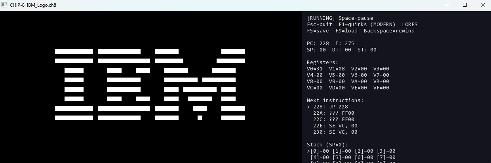

# CHIP-8 / SUPER-CHIP / MX-8 Emulator

A C++17 emulator + interactive debugger + Python assembler for CHIP-8,
SUPER-CHIP 1.1, and **MX-8** — six original opcodes layered on top of the
classic ISA.



## What's in the box

- **Pure emulator core** in `src/core/` (no graphics, no I/O coupling).
  35 standard CHIP-8 opcodes + the full SUPER-CHIP 1.1 set (hi-res 128x64,
  16x16 sprites, scroll D/U/L/R, big font, RPL flags, exit) +
  6 MX-8 extensions.
- **Live debugger sidebar**: registers, disassembly with breakpoint markers,
  stack, three memory panes, instruction trace ring buffer, status line.
- **Real debugger controls**: pause / step / step-over CALL / step-out,
  set/clear breakpoints, mid-execution memory editor.
- **Save state + 5-second rewind** on a ring buffer.
- **Granular quirks**: each of 7 CHIP-8 quirks toggleable independently
  (F1-F7), or one-shot to MODERN (F8) / VIP (F12) presets.
- **MX-8 ISA extension** (F11) — see below.
- **7 color palettes** (F10 cycles, or `--palette name`).
- **ROM browser** with paging, scroll, click-to-pick.
- **Python assembler** at `tools/asm.py` — labels, .org, .db, .dw, .ascii,
  .equ, full CHIP-8 + SCHIP + MX-8 mnemonics. Includes a self-test
  (`tools/test_asm.py`) covering all 54 opcodes.
- **Cross-platform font fallback** — bundled / Windows / Linux / macOS paths.
- **Configurable speed** (1..2000 cycles/frame, live `+/-`).

## Build (Windows / vcpkg / Visual Studio 2022)

```
vcpkg install sfml:x64-windows
cmake -S . -B build -G "Visual Studio 17 2022" -A x64 ^
      -DCMAKE_TOOLCHAIN_FILE=C:/vcpkg/scripts/buildsystems/vcpkg.cmake ^
      -DVCPKG_TARGET_TRIPLET=x64-windows
cmake --build build --config Release
```

Linux/macOS work with the same CMakeLists once you point CMake at an SFML 3
install. The post-build step copies `roms/` and `assets/` next to the
binary; vcpkg auto-deploys SFML DLLs.

## Run

```
# ROM picker (lists every .ch8 under roms/ recursively)
./build/Release/chip8.exe

# Specific ROM
./build/Release/chip8.exe roms/PONG.ch8

# Tweak everything
./build/Release/chip8.exe roms/TETRIS.ch8 --speed 25 --palette amber --legacy

# Run an MX-8 demo (custom opcodes enabled)
./build/Release/chip8.exe roms/mx8_demo.ch8 --mx8 --paused
```

CLI:

| Flag | Meaning |
|---|---|
| `--speed N`        | CPU cycles per frame (1..2000, default 12) |
| `--legacy`         | Boot with COSMAC VIP quirks |
| `--mx8`            | Enable MX-8 custom opcodes from start |
| `--paused`         | Boot paused |
| `--palette NAME`   | mono / amber / green / gameboy / c64 / ice / hotdog |
| `--rewind-sec N`   | Seconds of rewind history (default 5) |
| `--roms-dir DIR`   | Where the picker scans (default `roms`) |

## Hotkeys

### Game keypad

```
CHIP-8           Keyboard
1 2 3 C          1 2 3 4
4 5 6 D    -->   Q W E R
7 8 9 E          A S D F
A 0 B F          Z X C V
```

### Emulator + debugger

| Key | Action |
|---|---|
| `Esc`           | Open pause menu (Quit lives in the menu now; Alt+F4 still works) |
| `Space`         | Pause / resume |
| `N`             | Single step (paused) |
| `O`             | Step over a `CALL` (otherwise same as N) |
| `Enter`         | Step out — run until `RET` drops the SP |
| `B`             | Toggle execution breakpoint at current PC |
| `Shift+B`       | Clear all breakpoints |
| `W` (paused)    | Cycle memory watchpoint at cursor: none → R → W → RW → none |
| `Shift+W` (paused) | Clear all watchpoints |
| `F1`..`F7`      | Toggle each quirk independently (shift, ldst, jp-vx, vfreset, dispwait, clip) |
| `F8`            | Quirks → MODERN preset (SCHIP) |
| `F12`           | Quirks → LEGACY preset (COSMAC VIP) |
| `F11`           | Toggle MX-8 extensions |
| `F10`           | Cycle palette |
| `F5` / `F9`     | Save / load state |
| `Backspace` (hold) | Rewind |
| `+` / `-`       | Faster / slower CPU |
| `Tab`           | Mute beep |
| `P`             | Reset CPU |
| `M`             | Cycle memory pane (I / PC / cursor) |
| `Arrows`        | Move memory cursor (paused) |
| `[` / `]`       | Decrement / increment byte at cursor |

## The MX-8 extension

Six original opcodes activated by `F11` or `--mx8`. Encoded into unused
slots so they can't collide with classic CHIP-8 / SCHIP ROMs:

| Opcode | Mnemonic        | Effect                                                     |
|--------|-----------------|------------------------------------------------------------|
| `5XY1` | `MUL Vx, Vy`    | `Vx = (Vx * Vy) & 0xFF`, `VF = (Vx * Vy) >> 8` (overflow)  |
| `5XY2` | `DIV Vx, Vy`    | `Vx = Vx / Vy`, `VF = Vx % Vy`. `VF = 0xFF` if `Vy == 0`.  |
| `5XY3` | `SWAP Vx, Vy`   | Exchange `Vx` and `Vy` in one cycle.                       |
| `FX50` | `MEMCPY n`      | Copy `n = X+1` bytes from `[I]` to `[I + n]`.              |
| `FX60` | `MEMSET n`      | Fill `n = X+1` bytes at `[I]` with `V0`.                   |
| `FX70` | `RNDSEED n`     | Seed PRNG using `V0..V(n-1)` packed.                       |

These plug holes the original ISA leaves: there's no native multiply, no
fast block fill/copy, and no way to make RNG deterministic for testing.

## Assembler

```
python tools/asm.py demos/hello.asm -o demos/hello.ch8
python tools/asm.py demos/maze.asm  --listing --symbols
python tools/test_asm.py                        # self-test, 54 cases
```

Syntax:

```asm
    .equ HIGH_X, 0x3C
main:
    CLS
    LD V0, HIGH_X
    LD I, sprite
    DRW V0, V1, 5
loop:
    JP loop
sprite:
    .db 0xF0, 0x90, 0x90, 0x90, 0xF0
```

Numbers: `12`, `0x12`, `$12`, `0b1010`, `%1010`. Labels are case-sensitive.
Mnemonics are case-insensitive. See `demos/*.asm` for working examples
(`hello`, `maze`, `bounce`, `mx8_demo`).

## Event-driven state mutation

All UI / debugger / scripted state changes flow through a typed event queue
on the CPU, drained at the frame boundary. This is the foundation for
deterministic replay, headless test scripting, and lockstep networking.

```cpp
cpu.enqueue(WriteMemoryEvent{0x300, 0xAB});       // mem editor
cpu.enqueue(ToggleBreakpointEvent{0x250});         // debugger
cpu.enqueue(SetWatchpointEvent{0x600, kind, false});
cpu.enqueue(InjectKeyEvent{0xA, true});            // replay/scripting
cpu.enqueue(SetSeedEvent{0xCAFEBABE});
cpu.enqueue(ResetEvent{});
// ... drained next frame, in FIFO order, at a known sync point.
```

Events are pure data (`std::variant`) — no lambdas, no captured state — so
they are serializable, replayable, and safe to ship over a wire later.
Only machine-state mutations are events; configuration (quirks, ISA
choice, palette) and UI mode (paused / step / rewind) stay direct.

See `src/core/CoreEvents.hpp` for the full type list.

## Headless runner & regression suite

`chip8_run` is a no-SFML CLI for CI / fuzzing / regression testing.

```
build/Release/chip8_run.exe rom.ch8 --frames 600 --print-hash
build/Release/chip8_run.exe rom.ch8 --frames 600 --expect-hash 0xFA6CE8F707AC1F88
build/Release/chip8_run.exe rom.ch8 --frames 60 --isa schip --quirks legacy --seed 42
```

Exit codes: 0 = success, 1 = hash mismatch, 2 = halted before frame count, 3 = CLI/load error.

`tools/test_headless.py` runs `chip8_run` against a fixed set of (ROM, args, golden hash)
tuples — wired in for CI:

```
python tools/test_headless.py             # verify
python tools/test_headless.py --update    # regenerate golden hashes
```

## Rewind (hybrid model)

Hold `Backspace` to rewind one frame at a time. The rewind buffer doesn't
store one snapshot per frame — it stores **anchors** (full snapshots) at a
fixed cadence (one per second by default) plus the recorded **event log**
between them. To rewind to frame N, the App restores the latest anchor
≤ N and re-executes intervening frames deterministically, replaying any
events that were originally submitted on each of those frames.

Memory cost is constant per second of window, not per frame. The default
rewind window is 30 seconds (~180KB) and can be raised to minutes
without architectural cost via `--rewind-sec N`.

This works because every state mutation already flows through the event
queue (live keypad included), and the snapshot format already captures
RNG + memory + keypad state — see `src/core/RewindBuffer.hpp` for the
exact reconstruction contract.

## Replay system

Hermetic JSON replay files capture ROM bytes, ISA, quirks, seed, and the
full event stream needed to reproduce a session deterministically.

```
build/Release/chip8.exe roms/BREAKOUT.ch8                # play
# Shift+R toggles recording; on second press it writes replays/<rom>-<ts>.json

build/Release/chip8_run.exe --replay replays/breakout_demo.json --print-hash
# Replay-mode runs the recorded events at their scheduled frame ordinals.
# Embedded checkpoints are verified — any drift exits 1.
```

A replay is the source of truth: tampering with ROM bytes, seed, ISA, or
quirks produces a checkpoint mismatch. Sharing a replay lets a reviewer
reproduce your session byte-identically without your machine's PRNG seed.

Format: `chip8-replay` v1, see `src/core/Replay.hpp` for the schema.

## Desync diagnostics (--diff-replay)

When two replays *should* produce the same outcome but don't,
`chip8_run --diff-replay A.json B.json` binary-searches the first frame
at which their machine state diverges. Output reports per-component
deltas (registers vs memory vs RNG vs framebuffer vs stack) so you can
localize *what* drifted, not just *where*.

```
build/Release/chip8_run.exe --diff-replay a.json b.json
# input streams: 2 events, identical
# searching divergence in frames [0, 600) ...
#   divergence at frame 142:
#     memory       differs: 0xBD4E9B37638590EE  vs  0x3C26171756D63C45
```

The tool first compares input event streams. If those differ, it
refuses to proceed (use `--force` to diff anyway) — same inputs are a
prerequisite for a meaningful execution diff.

`chip8_run --replay file.json --self-check` re-runs a replay against
its own embedded checkpoints. Detects implementation drift: if the same
replay file produces a different framebuffer hash on a new build,
something changed in the emulator core.

The full machine-state fingerprint (`MachineStateDigest`) covers
framebuffer + memory + V0..VF + stack + RNG state + scalar fields
(PC/I/SP/timers/hires/halt). See [src/core/Chip8.hpp](src/core/Chip8.hpp).

## Project layout

```
src/
  core/      Chip8, Memory, CoreEvents, Disassembler   # pure emulator, no SFML
  core/isa/  IInstructionSet, Chip8ISA, SchipISA, Mx8ISA
  ui/        Renderer, Input, AudioBeep, DebugView, RomBrowser, FontLoader
  app/       Config, App                # main loop + orchestration
  main.cpp                              # tiny CLI entry point
tools/
  asm.py                                # CHIP-8 assembler
  test_asm.py                           # 54-case self-test
demos/                                  # .asm sources
roms/
  *.ch8                                 # public-domain games + assembled demos
  tests/                                # Timendus's CHIP-8 test suite
assets/fonts/                           # bundled font(s) — optional
```

## Verifying accuracy

Drop your favorite test ROMs into `roms/tests/` and pick from the browser.
The bundled `roms/tests/` already contains Timendus's full eight-stage
CHIP-8 test suite (chip8-logo, ibm-logo, corax+, flags, quirks, keypad,
beep, scrolling).

## Author

Made by Mehdi Lakhouane.
